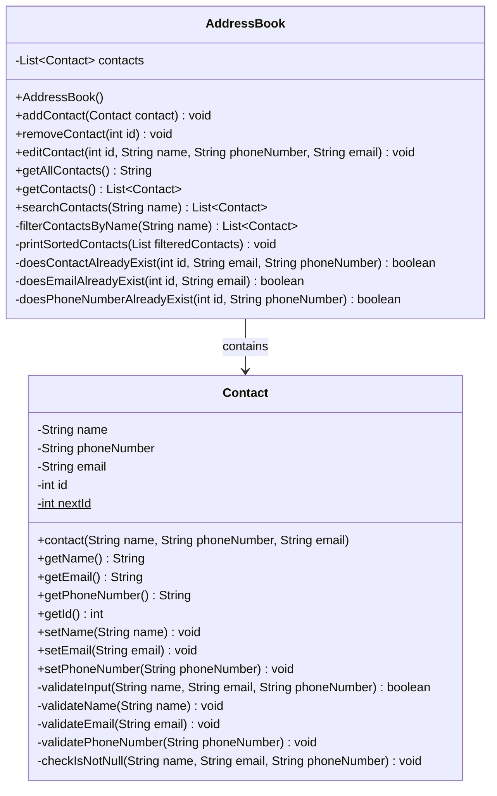
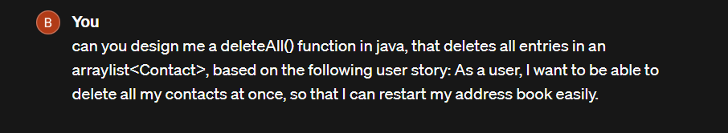
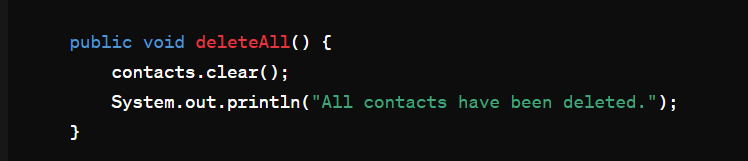
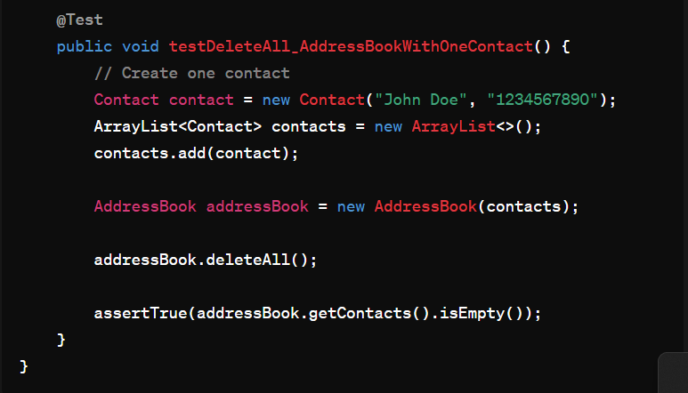

# Domain Models, Class Diagrams and Test Plan

---

## Trello Board

---

## Class Diagram

---
## User Story 1
As a user, I want to be able to add a contact to my address book, using a name, phone number and email address, so that I can keep my contacts organised.

## Test Cases
1. addContact() should add an entry to the Contact arraylist<>.
2. Contact constructor should reject an entry if the name is empty.
3. Contact constructor should reject an entry if the email format is invalid.
4. Contact constructor should reject an entry if the phone number format is invalid.
5. addContact() should reject null values.
6. Contact constructor should reject null values for name, email and phone number.
---

## User Story 2
As a user, I want to be able to search through my contacts by name, so that I can save time finding the details I need.

## Test Cases
1. searchContacts() should display a contact when the exact name is entered.
2. searchContacts() should be case-insensitive.
3. searchContacts() should display nothing when an incorrect name is entered.
4. searchContacts() should display nothing when an empty string is entered.
5. searchContacts() should return contacts that are partially matched.
6. searchContacts() should handle special characters correctly.
7. searchContacts() should return multiple contacts in alphabetical order.
---

## User Story 3 
As a user, I want to be able to remove a contact from my address book, so that I can remove out of date entries.

## Test Cases
1. removeContact() should remove a contact from contacts list using an ID.
2. Each contact should have a unique ID attribute.
3. removeContact() should return an error message if the ID is not found.
4. Once removed, the contact should not be found in the contacts list when using search contacts.
5. removeContact() should correctly handle sequential calls to remove contacts.

---

## User Story 4
As a user, I want to be able to edit a contacts details, so that I can update their information if it changes.

## Test Cases
1. editContact() should successfully update the contact details using the ID.
2. editContact() should return an error message if the ID is not found.
3. editContact() should reject an entry if attempting to use invalid formatting.
4. editContact() should handle editing multiple fields of the contact - name, email and phone number.
5. editContact() should handle sequential calls to edit contacts.
---

## User Story 5
As a user, I want the system to prevent me from adding a contact with a phone number or email address that already exists in the address book, so that I can avoid having duplicate entries.

## Test Cases
1. addContact() should reject an entry if the phone number already exists in the address book.
2. addContact() should reject an entry if the email already exists in the address book.
3. addContact() should reject an entry if both the phone number and email already exists in the address book.
4. editContact() should reject changes that match an existing email in the address book.
5. editContact() should reject changes that match an existing phone number in the address book.
6. addContact() should accept an entry that matches a previous entry that was deleted from the address book.
---

## User Story 6
As a user, I want to be able to view all contacts in the address book, so that I can browse through my entries to find what I need.

## Test Cases
1. getAllContacts() should return all contacts in the address book.
2. getAllContacts() should return an error message if there are no contacts.
3. getAllContacts() should return contacts in alphabetical order.
4. getAllContacts() should update when a contact is added or removed.
5. getAllContacts() should update when a contact is edited.

---

## User Story 7

As a user, I want to be able to delete all my contacts at once, so that I can restart my address book easily.

## AI help

## Test Cases

